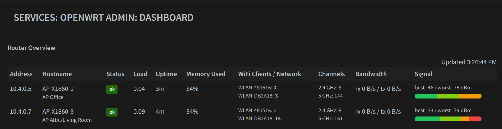
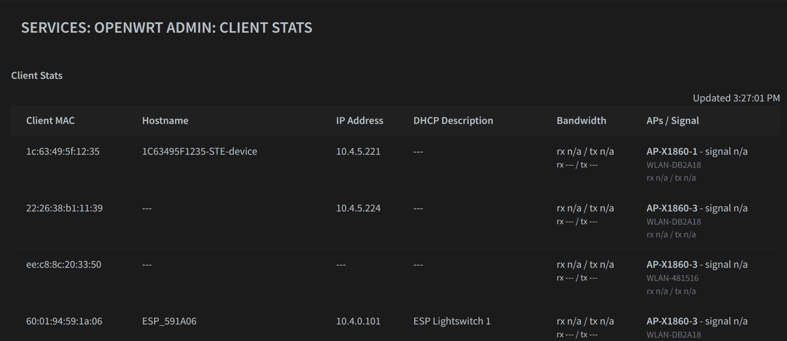
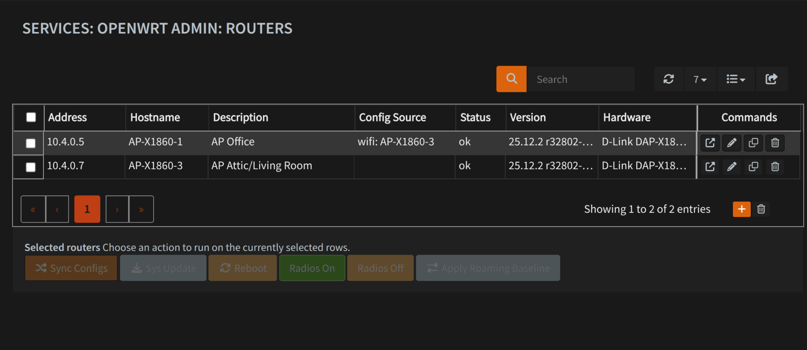
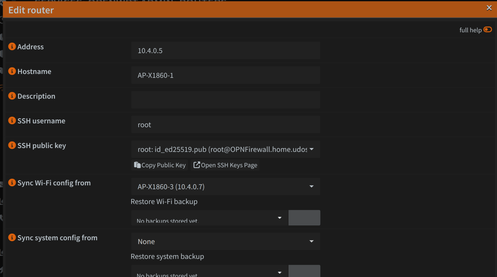
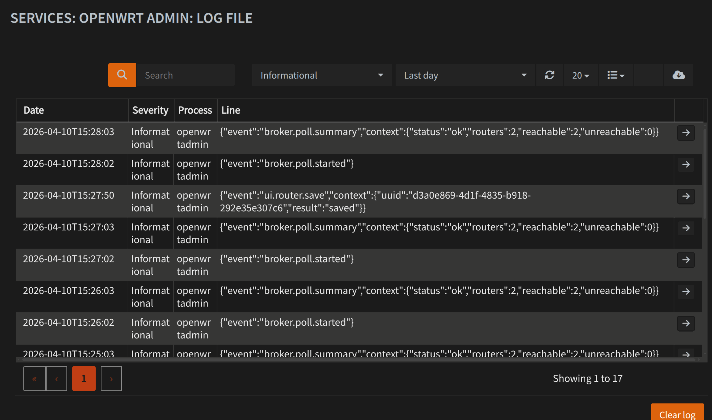

# opnsense-openwrt-admin

OPNsense plugin for managing a fleet of OpenWrt access points and routers from a central firewall UI.

## Features

- **Router inventory** — register OpenWrt routers by address, with live status polling (load, uptime, memory, firmware version, hardware model)
- **Wi-Fi client visibility** — see all associated clients across all APs in one table, with signal strength, throughput, and DHCP hostname enrichment
- **Historical stats** — graph hourly client counts and signal quality per Wi-Fi network over time, filterable by AP, network, and time window
- **Config sync** — push a source router's `wireless`, `system`, `firewall`, `dhcp`, or `rpcd` config to other routers of the same hardware model (system hostname is always preserved on the target)
- **Config backups** — the broker keeps a rolling history of each config type per router; backups can be restored from the UI
- **Bulk actions** — reboot, enable/disable Wi-Fi radios, or sync configs on multiple selected routers at once
- **Managed SSH keypair** — generate a dedicated ed25519 keypair stored in the plugin config; or use any existing system key

## Screenshots

The plugin is built around day-to-day fleet operations: quick status overview, client visibility, targeted configuration management, and auditable backend activity.

### Dashboard

Live fleet overview with router health, hardware, channel selection, radio-level client distribution, signal quality, and sampled bandwidth.



### Client Stats

Cross-AP client view with inferred hostname and IP address from DHCP data, plus AP association, signal strength, and traffic counters.



### Routers

Inventory and operations view for selecting routers, checking sync state, and triggering bulk actions such as config sync, roaming baseline rollout, reboot, or system updates.



### Router Config

Per-router configuration screen with SSH key selection, config parent relationships, and restore controls for stored config backups.



### Logging

Dedicated plugin log output for broker lifecycle events, UI-triggered actions, config syncs, and Wi-Fi client movement between access points.



## Architecture

```
OPNsense web UI (PHP/Volt)
    └─ REST API (PHP controllers)
         └─ BrokerClient → HTTP → broker daemon (Python)
                                       └─ SSH → OpenWrt routers
```

The **broker** (`broker.py`) is a long-running Python daemon that:
- Polls each router via SSH every `poll_interval_seconds` (default 60 s)
- Stores live state and config backups in a local SQLite database (`/var/db/openwrt-admin/state.sqlite`)
- Exposes a localhost-only HTTP API on `127.0.0.1:9783`

The **PHP layer** talks to the broker via `BrokerClient`, which falls back from cURL to PHP stream contexts if cURL is unavailable.

## Requirements

On **OPNsense**:
- Python 3 at `/usr/local/bin/python3`
- `curl` (for broker control script)
- SSH key authorized on each managed router

On each **OpenWrt router**:
- SSH daemon running on port 22 (default)
- `ubus` available (standard on OpenWrt)
- `hostapd` (for Wi-Fi client data; optional)
- The OPNsense SSH public key in `/root/.ssh/authorized_keys` (or the configured SSH user's `authorized_keys`)

## Security considerations

### SSH host key trust on first connect

The broker uses `StrictHostKeyChecking=accept-new`, which automatically accepts and persists a router's host key the first time it connects. This is convenient but means a man-in-the-middle attacker present at initial enrollment will be permanently trusted. For production deployments:

- Enroll routers only from a network segment you control
- After first contact, verify the stored fingerprints in `/var/db/openwrt-admin/known_hosts` against the router's own `/etc/dropbear/dropbear_ed25519_host_key` fingerprint

### Private key storage

The plugin-managed SSH private key is stored as plain text in `/conf/config.xml` and is included in any OPNsense configuration backup. Protect configuration backups accordingly.

### Broker HTTP API

The broker listens on `127.0.0.1:9783` with no authentication. Any local process on the firewall can trigger polls or router actions. The attack surface is limited to privileged local processes, but be aware that a compromised plugin running on the same machine could interact with the broker.

## Installation

Copy the plugin files to OPNsense:

```sh
# MVC, model, and views
cp -r src/opnsense/mvc/app/ /usr/local/opnsense/mvc/app/

# Broker daemon and control script
cp -r src/opnsense/scripts/OPNsense/ /usr/local/opnsense/scripts/OPNsense/

# configd actions
cp src/opnsense/service/conf/actions.d/actions_openwrtadmin.conf \
   /usr/local/opnsense/service/conf/actions.d/
configd restart

# rc.d service script
cp src/etc/rc.d/openwrtadmin /usr/local/etc/rc.d/
chmod +x /usr/local/etc/rc.d/openwrtadmin

# Plugin hook
cp src/etc/inc/plugins.inc.d/openwrtadmin.inc /usr/local/etc/inc/plugins.inc.d/

# Rebuild menu cache
rm -f /var/lib/php/tmp/opnsense_menu_cache.xml
```

The UI is available at `/ui/openwrtadmin`.

For local development, `scripts/deploy-dev.sh` can be used to copy files to a target firewall, refresh caches, reload syslog templates, restart `configd`, and restart the broker service.

```sh
scripts/deploy-dev.sh my-opnsense-host
```

If you use SSHFS mounts, the script will prefer `${MOUNT_BASE:-/root/mount_ssh}/<target-host>` automatically. Otherwise it falls back to SSH/SCP deployment.

## Configuration

All settings are under **Services → OpenWrt Admin → Settings**:

| Setting | Default | Description |
|---|---|---|
| Poll interval (s) | 60 | How often the broker polls each router |
| SSH connect timeout (s) | 5 | Timeout for establishing an SSH connection |
| SSH command timeout (s) | 15 | Timeout per SSH command |
| Max parallel polls | 8 | How many routers are polled concurrently |
| Config backup limit | 8 | Max historical backups per router per config type |
| Hourly stats retention (days) | 90 | How long aggregated client-count and signal history is retained before automatic cleanup |

Changes to poll interval, max parallel polls, SSH timeouts, backup limit, and hourly stats retention take effect after restarting the broker service.

Per-router settings (under **Services → OpenWrt Admin → Routers**):
- **SSH username** — defaults to `root`; change if you use a dedicated SSH user
- **SSH public key** — select the firewall key to authorize on this router
- **Sync source** — set independently per config type (Wi-Fi, system, firewall, DHCP, rpcd)

## Testing

The broker has a stdlib-only unit test suite under `tests/` that exercises config sync logic, backup deduplication, and SSH error classification using temporary in-memory state.

```sh
make test
# or
python3 -m unittest discover -s tests -p 'test_*.py'
```

## Submission checklist

- Open an issue in `opnsense/plugins` first to discuss the plugin scope
- Import the plugin under an appropriate category directory in that repository
- Keep the code BSD-2-Clause licensed
- Avoid precompiled binaries and undisclosed bundled dependencies
- Disclose AI assistance in the pull request, as requested by OPNsense
